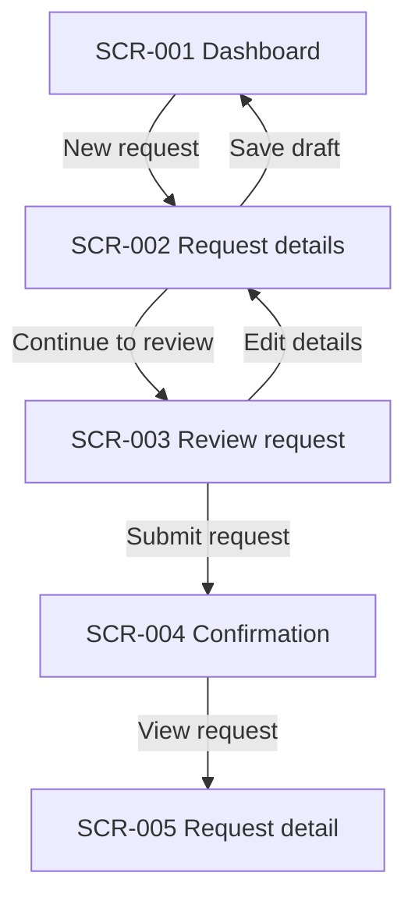

# Sample BRD-to-UX Output: Request Creation

This example shows the style of output expected from the UI/UX Designer skill. It is intentionally small.

## Executive UX recommendation

Use a four-screen request creation flow: Dashboard → Request Details → Review → Confirmation. This keeps the task short, adds a review step before submission, and gives users recovery options through save draft and edit actions.

## Assumptions

| ID | Assumption | Impact |
|---|---|---|
| A-001 | Users are already authenticated. | Login flow excluded. |
| A-002 | The request form has fewer than 10 required fields. | A single details page is appropriate. |

## Requirement traceability

| Requirement ID | Requirement summary | UX handling | Screen/flow IDs |
|---|---|---|---|
| REQ-001 | User can create a request. | New request primary action and details form. | FLOW-001, SCR-001, SCR-002 |
| REQ-002 | User can review before submit. | Review screen with edit links. | SCR-003 |
| REQ-003 | User receives confirmation. | Success screen with confirmation number and next actions. | SCR-004 |

## Flow diagram

## Screen-by-screen flow

| Step | Screen ID | User action | System response | Next screen | Requirements | Edge cases |
|---:|---|---|---|---|---|---|
| 1 | SCR-001 | Selects New request | Displays request details form | SCR-002 | REQ-001 | No permission shows guidance |
| 2 | SCR-002 | Enters details and continues | Validates and displays review | SCR-003 | REQ-001, REQ-002 | Inline validation errors |
| 3 | SCR-003 | Reviews and submits | Creates request | SCR-004 | REQ-002, REQ-003 | System error preserves draft |
| 4 | SCR-004 | Views confirmation | Shows next actions | terminal | REQ-003 | None |

## Screen specifications

| Screen ID | Name | Purpose | Primary action | Key components | States | Validations | Accessibility | Dev notes |
|---|---|---|---|---|---|---|---|---|
| SCR-001 | Dashboard | Start and track requests | New request | Status cards, recent requests | default, loading, empty, error | None | Status text must not rely on color alone | GET recent requests |
| SCR-002 | Request details | Capture minimum data | Continue to review | Single-column form, attachments | default, saving, validation_error, system_error | Required title/description, file limits | Error summary receives focus | POST draft |
| SCR-003 | Review request | Verify before submit | Submit request | Summary list, edit links | default, submitting, error | Draft still valid | Edit links include section names | POST request |
| SCR-004 | Confirmation | Confirm completion | View request | Success panel | default | None | Success announced to assistive tech | Show request ID |

## Design modifications made

| Decision ID | Initial interpretation/problem | Modification | Rationale |
|---|---|---|---|
| DD-001 | BRD implied immediate submission from details form | Added review screen | Reduces submission errors for high-stakes data |
| DD-002 | All fields visible at once | Grouped fields into sections | Reduces cognitive load |
| DD-003 | No draft state described | Added save draft | Protects progress in longer forms |

## UX quality scorecard

| Dimension | Initial score | Final score | Notes |
|---|---:|---:|---|
| Learnability | 3 | 4 | Primary actions and step purpose clarified |
| Efficiency | 3 | 4 | Unnecessary request type step removed |
| Error prevention | 2 | 4 | Inline validation and review added |
| Accessibility | 2 | 4 | Error focus and non-color status specified |
| Developer readiness | 2 | 5 | States, APIs, validations, ACs specified |

## Acceptance criteria

| AC ID | Scenario | Expected result | Priority |
|---|---|---|---|
| AC-001 | User starts request from dashboard | Request details screen opens | must |
| AC-002 | Required field is blank | Inline error appears and focus moves to error summary | must |
| AC-003 | User edits from review | Details screen opens with entered data preserved | must |
| AC-004 | Submission succeeds | Confirmation number appears with next actions | must |
