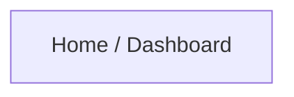
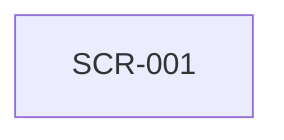

# UI/UX Flow Output Template

## 1. Executive UX recommendation

Briefly state the recommended flow, the primary design rationale, and the expected user benefit.

## 2. Assumptions and open questions

| ID | Type | Item | Impact | Recommended resolution |
|---|---|---|---|---|
| A-001 | Assumption |  |  |  |
| Q-001 | Open question |  |  |  |

## 3. Requirement traceability

| Requirement ID | Requirement summary | UX handling | Flow/screen IDs | Notes |
|---|---|---|---|---|
| REQ-001 |  |  |  |  |

## 4. User roles and goals

| Role ID | Role | Primary goals | Permissions/constraints |
|---|---|---|---|
| ROLE-001 |  |  |  |

## 5. Optimized information architecture

Describe the navigation model and key sections.

## 5a. Visual design direction

State the chosen aesthetic direction (e.g., functional minimal) and a one-line rationale tied to the product's purpose. Then provide the design tokens (light + dark where relevant). See `references/visual_design_system.md`.

**Color (roles)**

| Token | Light | Dark | Notes |
|---|---|---|---|
| bg / surface / surface-raised |  |  |  |
| text / text-muted / text-subtle |  |  | meets AA |
| primary / primary-hover / primary-tint / on-primary |  |  |  |
| success / warning / danger / info (+ soft bg) |  |  | not color-only |
| border / focus-ring |  |  |  |

**Typography** — families, scale steps, weights, line-heights, reading measure.

**Spacing & layout** — base unit (4/8px) and scale; breakpoints; container widths.

**Radius / elevation / motion** — radius scale; shadow scale; motion durations + easings + reduced-motion plan.

## 6. Screen-by-screen flow

| Step | Screen ID | User action | System response | Next screen | Requirements | Edge cases |
|---:|---|---|---|---|---|---|
| 1 | SCR-001 |  |  |  |  |  |

## 7. Screen specifications

| Screen ID | Name | Purpose | Primary action | Key components | States | Validations | Accessibility | Dev notes |
|---|---|---|---|---|---|---|---|---|
| SCR-001 |  |  |  |  | default, loading, error |  |  |  |

## 7a. Visual & motion notes

| Screen ID | Hierarchy intent (1st/2nd/3rd) | Key token usage | Density | Motion / feedback | Reduced-motion |
|---|---|---|---|---|---|
| SCR-001 |  |  |  |  |  |

## 8. Design decisions and modifications

| Decision ID | Initial interpretation/problem | Modification | Rationale | Impact |
|---|---|---|---|---|
| DD-001 |  |  |  |  |

## 9. UX quality scorecard

| Dimension | Initial score | Final score | Notes |
|---|---:|---:|---|
| Learnability |  |  |  |
| Efficiency |  |  |  |
| Navigation clarity |  |  |  |
| Information architecture |  |  |  |
| Content clarity |  |  |  |
| Consistency |  |  |  |
| Error prevention |  |  |  |
| Error recovery |  |  |  |
| Accessibility |  |  |  |
| Cognitive load |  |  |  |
| Trust and transparency |  |  |  |
| Visual hierarchy & modern aesthetic |  |  |  |
| Motion & feedback |  |  |  |
| Developer readiness |  |  |  |

## 10. Developer handoff

Attach or include JSON/YAML following `developer_handoff.schema.json`.

## 11. Acceptance criteria and test scenarios

| AC ID | Flow/screen | Scenario | Expected result | Priority |
|---|---|---|---|---|
| AC-001 |  |  |  | must |
